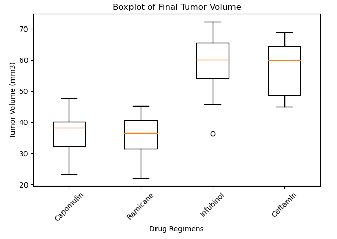
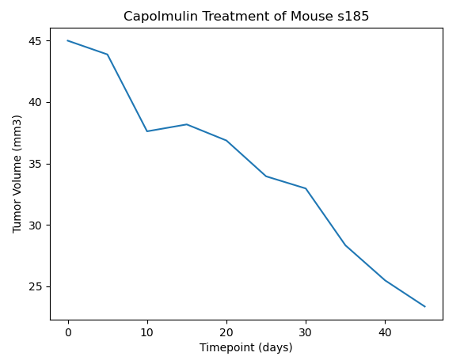
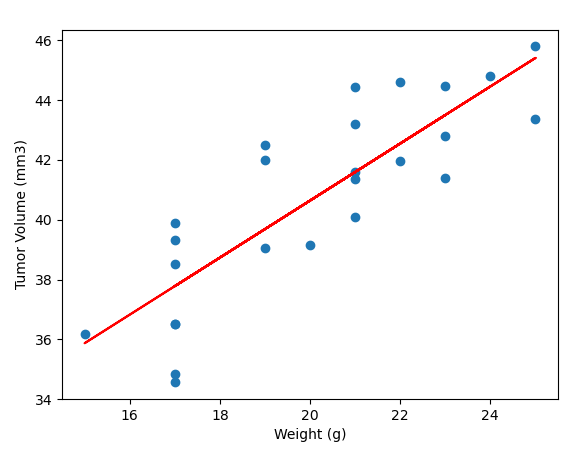

# matplotlib-challenge

## Goal

-The goal of this challenge is to analyze data using the Matplotlib library in Python with Jupyter Notebook.

## Analysis

-Pharmaceutical data and results of different drug treatments on cancer in mice.

-Some of the results below:

